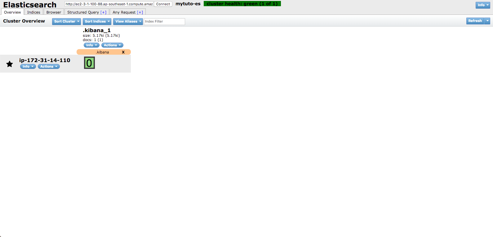

# System Script 1st

ElasticSearch 첫 번째 System 명령어 스크립트를 기술합니다.

## YUM Repository 등록으로 설치하기 
ElasticSearch 를 설치하기 위해서는 항상 Java 를 설치해야 합니다.

```bash
[ec2-user@ip-xxx-xxx-xxx-xxx ~]$ sudo yum -y install java

[ec2-user@ip-xxx-xxx-xxx-xxx ~]$ sudo vi /etc/yum.repos.d/elasticsearch.repo

[elasticsearch-6.x]
name=Elasticsearch repository for 6.x packages
baseurl=https://artifacts.elastic.co/packages/6.x/yum
gpgcheck=1
gpgkey=https://artifacts.elastic.co/GPG-KEY-elasticsearch
enabled=1
autorefresh=1
type=rpm-md

[ec2-user@ip-xxx-xxx-xxx-xxx ~]$ sudo yum install elasticsearch
```

## RPM 으로 설치하기 

```bash
[ec2-user@ip-xxx-xxx-xxx-xxx ~]$ sudo yum -y install wget

[ec2-user@ip-xxx-xxx-xxx-xxx ~]$ wget https://artifacts.elastic.co/downloads/elasticsearch/elasticsearch-6.6.0.rpm

[ec2-user@ip-xxx-xxx-xxx-xxx ~]$ sudo rpm -ivh ./elasticsearch-6.6.0.rpm
```

## zip, tar Download 하여 설치하기 

* zip
```bash
[ec2-user@ip-xxx-xxx-xxx-xxx ~]$ sudo yum -y install unzip

[ec2-user@ip-xxx-xxx-xxx-xxx ~]$ wget https://artifacts.elastic.co/downloads/elasticsearch/elasticsearch-6.6.0.zip

[ec2-user@ip-xxx-xxx-xxx-xxx ~]$ unzip elasticsearch-6.6.0.zip
```

* tar.gz
```bash
[ec2-user@ip-xxx-xxx-xxx-xxx ~]$ wget https://artifacts.elastic.co/downloads/elasticsearch/elasticsearch-6.6.0.tar.gz

[ec2-user@ip-xxx-xxx-xxx-xxx ~]$ tar -xzf elasticsearch-6.6.0.tar.gz
```

## Elasticsearch 실행하기 

* CentOS/RHEL 6
```bash
[ec2-user@ip-xxx-xxx-xxx-xxx ~]$ sudo service elasticsearch start
```

* CentOS/RHEL 7
```bash
[ec2-user@ip-xxx-xxx-xxx-xxx ~]$ sudo systemctl start elasticsearch.service
```

* Source Install
```bash
[ec2-user@ip-xxx-xxx-xxx-xxx ~]$ cd elasticsearch-6.6.0

[ec2-user@ip-xxx-xxx-xxx-xxx elasticsearch-6.6.0]$ bin/elasticsearch -d
```

### Smoke Test 
```bash
[ec2-user@ip-xxx-xxx-xxx-xxx ~]$ ps ax | grep elasticsearch

[ec2-user@ip-xxx-xxx-xxx-xxx ~]$ curl localhost:9200
{
  "name" : "ip-172-31-14-110",
  "cluster_name" : "mytuto-es",
  "cluster_uuid" : "52XfKjycSLCSwXqT_YPMXA",
  "version" : {
    "number" : "6.6.0",
    "build_flavor" : "default",
    "build_type" : "rpm",
    "build_hash" : "a9861f4",
    "build_date" : "2019-01-24T11:27:09.439740Z",
    "build_snapshot" : false,
    "lucene_version" : "7.6.0",
    "minimum_wire_compatibility_version" : "5.6.0",
    "minimum_index_compatibility_version" : "5.0.0"
  },
  "tagline" : "You Know, for Search"
}
```

* Web Browser 에 [http://ec2-3-0-99-205.ap-southeast-1.compute.amazonaws.com:9100/index.html?base_uri=http://FQDN:9200](http://ec2-3-0-99-205.ap-southeast-1.compute.amazonaws.com:9100/index.html?base_uri=http://FQDN:9200) 실행



### Trouble Shooting
Smoke Test 가 진행되지 않을 때에는 elasticsearch.yml 파일에 기본으로 설정되어있는 로그 디렉토리의 로그를 살펴봅니다.

YUM, RPM 을 통한 설치는 path.logs: /var/log/elasticsearch 로, Source 설치는 {install path}/logs 로 설정되어 cluster.name 이 적용된 파일을 만들어 로깅됩니다.

위의 경우에는 /var/log/elasticsearch/{cluster.name}.log, ~/elasticsearch-6.6.0/logs/{cluster.name}.log 에서 확인할 수 있습니다.

* YUM, RPM 
```bash
[ec2-user@ip-xxx-xxx-xxx-xxx ~]$ sudo vi /var/log/elasticsearch/{cluster.name}.log
```

* Source
```bash
[ec2-user@ip-xxx-xxx-xxx-xxx ~]$ sudo vi ./elasticsearch-6.6.0/logs/{cluster.name}.log
```

## Kibana Dev Tools 활용하기 

```bash
[ec2-user@ip-xxx-xxx-xxx-xxx ~]$ sudo vi /etc/yum.repos.d/kibana.repo

[kibana-6.x]
name=Kibana repository for 6.x packages
baseurl=https://artifacts.elastic.co/packages/6.x/yum
gpgcheck=1
gpgkey=https://artifacts.elastic.co/GPG-KEY-elasticsearch
enabled=1
autorefresh=1
type=rpm-md

[ec2-user@ip-xxx-xxx-xxx-xxx ~]$ sudo yum install kibana

[ec2-user@ip-xxx-xxx-xxx-xxx ~]$ sudo vi /etc/kibana/kibana.yml

server.host: "0.0.0.0"
elasticsearch.url: "http://localhost:9200"
kibana.index: ".kibana"
```

## Kibana 실행하기 

* CentOS/RHEL 6
```bash
[ec2-user@ip-xxx-xxx-xxx-xxx ~]$ sudo service kibana start
```

* CentOS/RHEL 7
```bash
[ec2-user@ip-xxx-xxx-xxx-xxx ~]$ sudo systemctl start kibana.service
```

* Web Browser 에 [http://{FQDN}:5601](http://{FQDN}:5601) 실행


