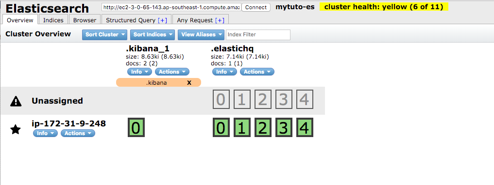
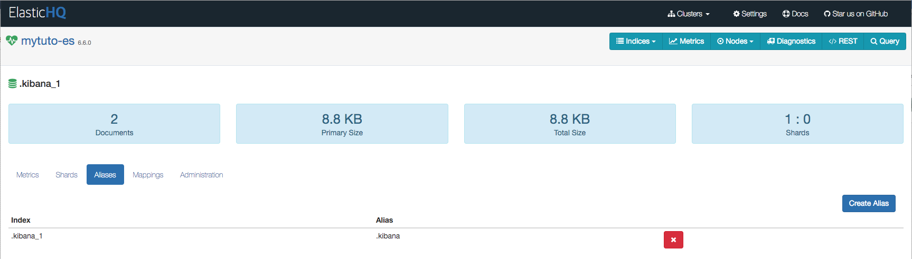

# System Script 2nd

ElasticSearch 두 번째 System 명령어 스크립트를 기술합니다.

## Plugin 설치하는 방법 

```bash
[ec2-user@ip-xxx-xxx-xxx-xxx elasticsearch]$  sudo bin/elasticsearch-plugin install analysis-nori
-> Downloading analysis-nori from elastic
[=================================================] 100%
-> Installed analysis-nori
[ec2-user@ip-xxx-xxx-xxx-xxx elasticsearch]$ sudo bin/elasticsearch-plugin list
analysis-nori

[ec2-user@ip-xxx-xxx-xxx-xxx elasticsearch]$ sudo bin/elasticsearch-plugin remove analysis-nori
-> removing [analysis-nori]...

[ec2-user@xxx-xxx-xxx-xxx elasticsearch]$ sudo bin/elasticsearch-plugin list
[ec2-user@ip-xxx-xxx-xxx-xxx elasticsearch]$
```

## head 플러그인 설치 
* ElasticSearch 클러스터의 노드, 인덱스, 샤드 등을 한 눈에 볼 수 있는 플러그인
* 2.x 버전까지는 내부 빌트인 플러그인 형태로 존재했으니 5.x 버전부터 standalone 형태로 변경됨
* 9100 포트로 실행됨

```bash
[ec2-user@ip-xxx-xxx-xxx-xxx ~]$ sudo yum -y install git

[ec2-user@ip-xxx-xxx-xxx-xxx ~]$ sudo yum -y install bzip2 epel-release

[ec2-user@ip-xxx-xxx-xxx-xxx ~]$ sudo yum -y install npm

[ec2-user@ip-xxx-xxx-xxx-xxx ~]$ cd /usr/local/

[ec2-user@ip-xxx-xxx-xxx-xxx ~]$ sudo git clone https://github.com/mobz/elasticsearch-head.git

[ec2-user@ip-xxx-xxx-xxx-xxx ~]$ cd elasticsearch-head/

[ec2-user@ip-xxx-xxx-xxx-xxx ~]$ sudo npm install

[ec2-user@ip-xxx-xxx-xxx-xxx ~]$ nohup npm run start &

```

### HQ Plugin 설치 
* 클러스터의 노드나 상세 상태정보 값을 모니터링 할 수 있는 플러그인
* Head Plugin 과 마찬가지로 2.x 버전까지는 내부 빌트인 플러그인 형태로 존재했으니 5.x 버전부터 standalone 형태로 변경됨
* 5000 포트로 실행됨

```bash
[ec2-user@ip-xxx-xxx-xxx-xxx ~]$ sudo yum -y install git

[ec2-user@ip-xxx-xxx-xxx-xxx ~]$ sudo yum -y install bzip2 epel-release

[ec2-user@ip-xxx-xxx-xxx-xxx ~]$ cd /usr/local/

[ec2-user@ip-xxx-xxx-xxx-xxx ~]$ sudo git clone https://github.com/ElasticHQ/elasticsearch-HQ.git

[ec2-user@ip-xxx-xxx-xxx-xxx ~]$ cd elasticsearch-HQ/

[ec2-user@ip-xxx-xxx-xxx-xxx ~]$ sudo yum -y install python34 python34-pip

[ec2-user@ip-xxx-xxx-xxx-xxx ~]$ sudo pip3 install -r requirements.txt

[ec2-user@ip-xxx-xxx-xxx-xxx ~]$ sudo nohup python3 application.py &
```

## Smoke Test

### Head Plugin

* Web Browser 에 http://Head Plugin 설치한 장비의 FQDN:9100/index.html?base_uri=http://{ES Cluster FQDN}:9200 실행



### HQ Plugin
* Web Browser 에 http://FQDN:5000 실행



