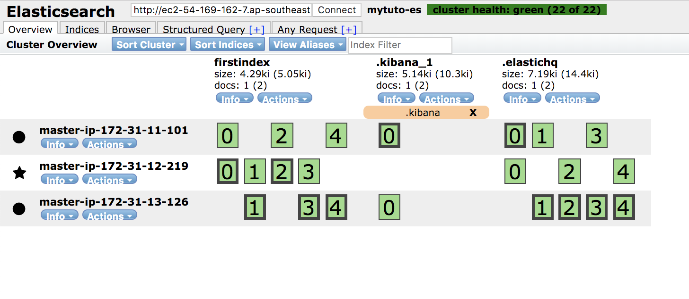

# ES-Tutorial-3-1

ElasticSearch 세 번째-1 튜토리얼을 기술합니다.

본 스크립트는 외부 공인망을 기준으로 작성되었습니다.

## Product 별 버전 상세
```
Product Version. 6.6.0(2019/02/07 기준 Latest Ver.)
```
* [Elasticsearch](https://artifacts.elastic.co/downloads/elasticsearch/elasticsearch-6.6.0.rpm)
* [Kibana](https://artifacts.elastic.co/downloads/kibana/kibana-6.6.0-x86_64.rpm)

최신 버전은 [Elasticsearch 공식 홈페이지](https://www.elastic.co/downloads) 에서 다운로드 가능합니다.

## ElasticSearch Product 설치

이 튜토리얼에서는 rpm 파일을 이용하여 실습합니다.

https://github.com/benjamin-btn/ES-Tutorial-2

Master 2~3번 장비에서 실습합니다.

```bash
[ec2-user@ip-xxx-xxx-xxx-xxx ~]$ sudo yum -y install git

[ec2-user@ip-xxx-xxx-xxx-xxx ~]$ git clone https://github.com/benjamin-btn/ES-Tutorial-3-1.git

[ec2-user@ip-xxx-xxx-xxx-xxx ~]$ cd ES-Tutorial-3-1

[ec2-user@ip-xxx-xxx-xxx-xxx ES-Tutorial-3-1]$ ./tuto3
##################### Menu ##############
 $ ./tuto3 [Command]
#####################%%%%%%##############
         1 : install java & elasticsearch packages
         2 : configure elasticsearch.yml & jvm.options
         3 : start elasticsearch process
#########################################

```

## ELK Tutorial 3 - Elasticsearch Node 추가

### Elasticsearch
##### /etc/elasticsearch/elasticsearch.yml

1) cluster.name, node.name, http.cors.enabled, http.cors.allow-origin 기존장비와 동일 설정
2) http.port, transport.tcp.port 추가 설정
3) **network.host 를 network.bind_host 와 network.publish_host 로 분리**
4) node.master, node.data role 추가 설정

```bash
[ec2-user@ip-xxx-xxx-xxx-xxx ES-Tutorial-3-1]$ ./tuto3 1

[ec2-user@ip-xxx-xxx-xxx-xxx ES-Tutorial-3-1]$ ./tuto3 2

[ec2-user@ip-xxx-xxx-xxx-xxx ES-Tutorial-3-1]$ sudo vi /etc/elasticsearch/elasticsearch.yml
### For ClusterName & Node Name
cluster.name: mytuto-es
node.name: master-ip-172-31-13-110

### For Head
http.cors.enabled: true
http.cors.allow-origin: "*"

### For Response by External Request
network.bind_host: 0.0.0.0
network.publish_host: {IP}

### ES Port Settings
http.port: 9200
transport.tcp.port: 9300

### ES Node Role Settings
node.master: true
node.data: true

```

5) discovery.zen.minimum_master_nodes 추가 설정
6) discovery.zen.ping.unicast.hosts 는 직접 수정 필요
7) **./tuto3 1 ./tuto3 2 실행 후 discovery.zen.ping.unicast.hosts 에 기존 장비와 추가하는 노드 2대의 ip:9300 설정 필요**

```bash
[ec2-user@ip-xxx-xxx-xxx-xxx ES-Tutorial-3-1]$ sudo vi /etc/elasticsearch/elasticsearch.yml

### Discovery Settings
discovery.zen.minimum_master_nodes: 2
discovery.zen.ping.unicast.hosts: [  "{IP1}:9300",  "{IP2}:9300",  "{IP3}:9300",  ]

```

8) 클러스터에 노드 2대가 정상적으로 추가되면 기존 장비 한 대의 설정도 동일하게 수정해둡니다. **ES 프로세스를 재시작할 필요는 없습니다.** 나중에 장애 혹은 작업으로 재시작 될 때 클러스터에 수정한 정보를 바탕으로 조인됩니다. 튜토 1에서 설치한 장비에 아래 세팅을 추가해줍니다.

```bash
### For Response by External Request
network.bind_host: 0.0.0.0
network.publish_host: {IP}

### ES Port Settings
http.port: 9200
transport.tcp.port: 9300

### ES Node Role Settings
node.master: true
node.data: true

### Discovery Settings
discovery.zen.minimum_master_nodes: 2
discovery.zen.ping.unicast.hosts: [  "{IP1}:9300",  "{IP2}:9300",  "{IP3}:9300",  ]

```

##### /etc/elasticsearch/jvm.options
9) Xms1g, Xmx1g 를 물리 메모리의 절반으로 수정

```bash
[ec2-user@ip-xxx-xxx-xxx-xxx ES-Tutorial-3-1]$ sudo vi /etc/elasticsearch/jvm.options

-Xms2g
-Xmx2g

```

10) 두 파일 모두 수정이 완료되었으면 추가할 노드 2대에서 스크립트 3번을 실행하여 ES 프로세스 시작, 클러스터에 잘 조인되는지 확인

```bash
[ec2-user@ip-xxx-xxx-xxx-xxx ES-Tutorial-3-1]$ ./tuto3 3

```

## Smoke Test

### Elasticsearch

```bash
[ec2-user@ip-xxx-xxx-xxx-xxx ES-Tutorial-3-1]$ curl localhost:9200
{
  "name" : "master-ip-172-31-11-101",
  "cluster_name" : "mytuto-es",
  "cluster_uuid" : "LTfRfk3KRLS31kQDROVu9A",
  "version" : {
    "number" : "6.6.0",
    "build_flavor" : "default",
    "build_type" : "rpm",
    "build_hash" : "a9861f4",
    "build_date" : "2019-01-24T11:27:09.439740Z",
    "build_snapshot" : false,
    "lucene_version" : "7.6.0",
    "minimum_wire_compatibility_version" : "5.6.0",
    "minimum_index_compatibility_version" : "5.0.0"
  },
  "tagline" : "You Know, for Search"
}

```

* Web Browser 에 [http://ec2-52-221-155-168.ap-southeast-1.compute.amazonaws.com:9100/index.html?base_uri=http://FQDN:9200](http://ec2-52-221-155-168.ap-southeast-1.compute.amazonaws.com:9100/index.html?base_uri=http://FQDN:9200) 실행



## Trouble Shooting

### Elasticsearch
Smoke Test 가 진행되지 않을 때에는 elasticsearch.yml 파일에 기본으로 설정되어있는 로그 디렉토리의 로그를 살펴봅니다.

path.logs: /var/log/elasticsearch 로 설정되어 cluster.name 이 적용된 파일로 만들어 로깅됩니다.

위의 경우에는 /var/log/elasticsearch/mytuto-es.log 에서 확인할 수 있습니다.

```bash
[ec2-user@ip-xxx-xxx-xxx-xxx ES-Tutorial-3-1]$ sudo vi /var/log/elasticsearch/mytuto-es.log
```

