# monworker

ElasticSearch 클러스터 상태 체크를 하는 스크립트를 기술합니다.
* 개발환경 - Python 2.7.10
* json, urllib3 datetime, influxdb site package import

## monworker 스크립트 설치하기

```bash
[ec2-user@ip-xxx-xxx-xxx-xxx ~]$ sudo yum -y install git
[ec2-user@ip-xxx-xxx-xxx-xxx ~]$ 
[ec2-user@ip-xxx-xxx-xxx-xxx ~]$ sudo git clone https://github.com/benjamin-btn/monworker.git

```

## 사용 방법

```bash
[ec2-user@ip-xxx-xxx-xxx-xxx ~]$ while(true); do ./monworker.py;sleep 1; done

```

```bash
[ec2-user@ip-xxx-xxx-xxx-xxx ~]$ ./bulk localhost:9200

```

```bash
[ec2-user@ip-xxx-xxx-xxx-xxx ~]$ influx -precision rfc3339
Connected to http://localhost:8086 version 1.x.x
InfluxDB shell 1.x.x
> use mdb
> select * from docs

```

## Grafana Settings

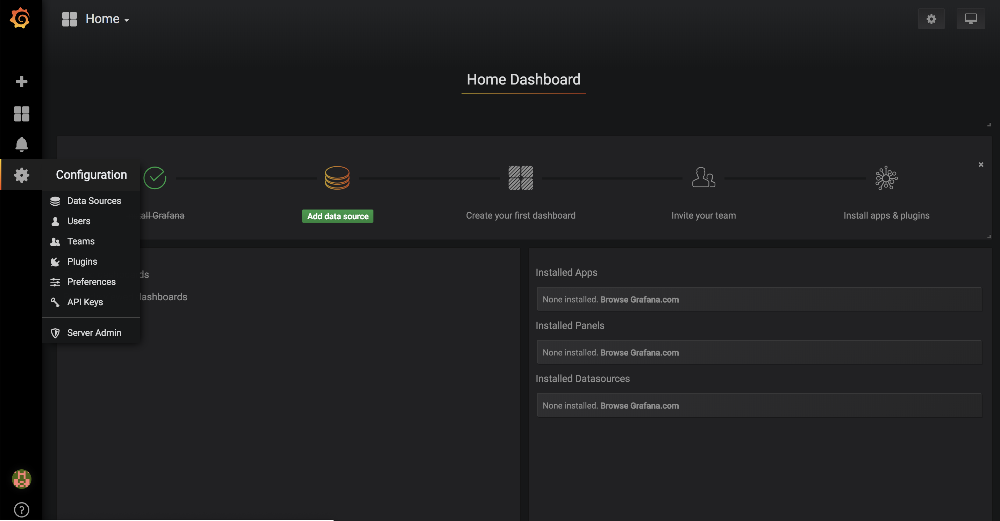
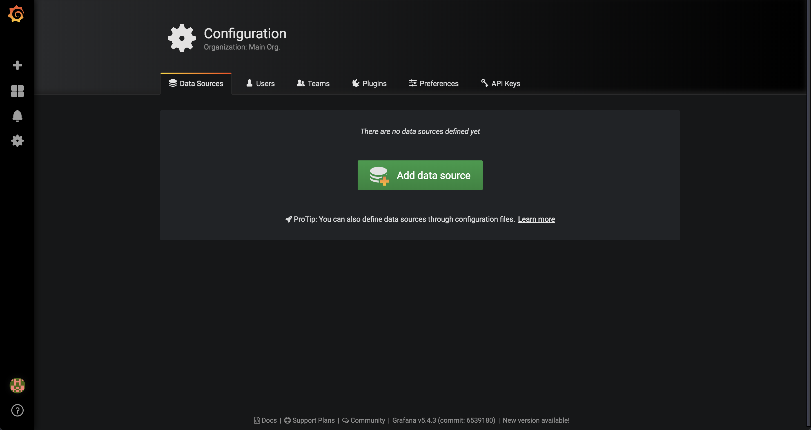
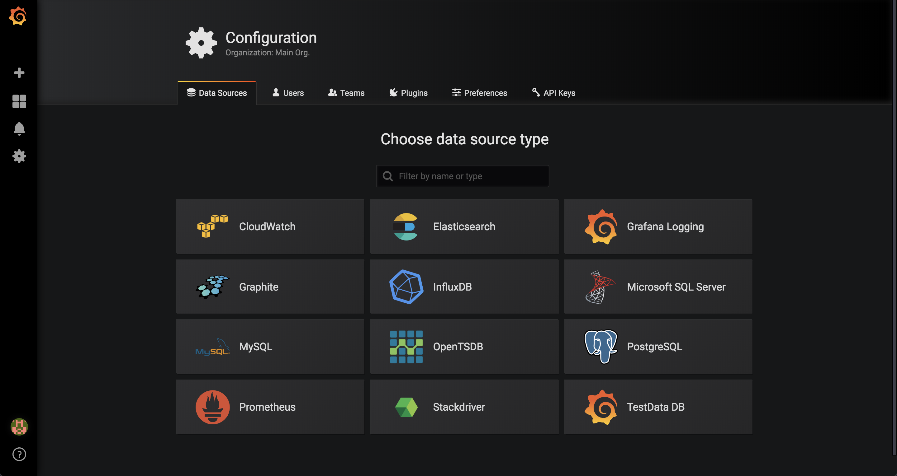
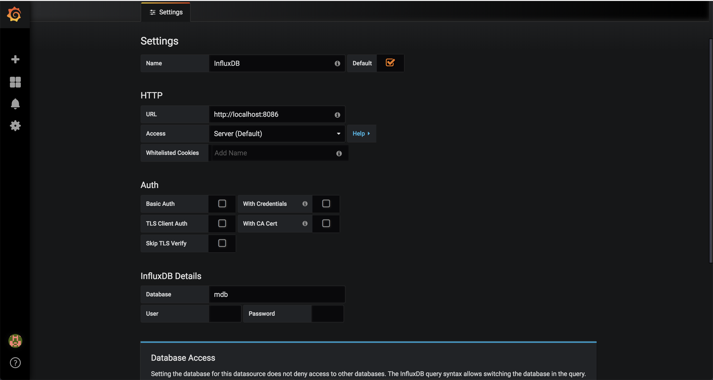
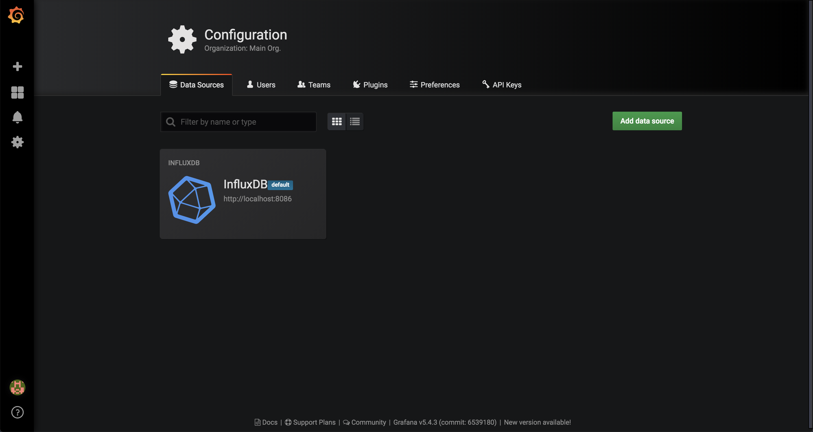
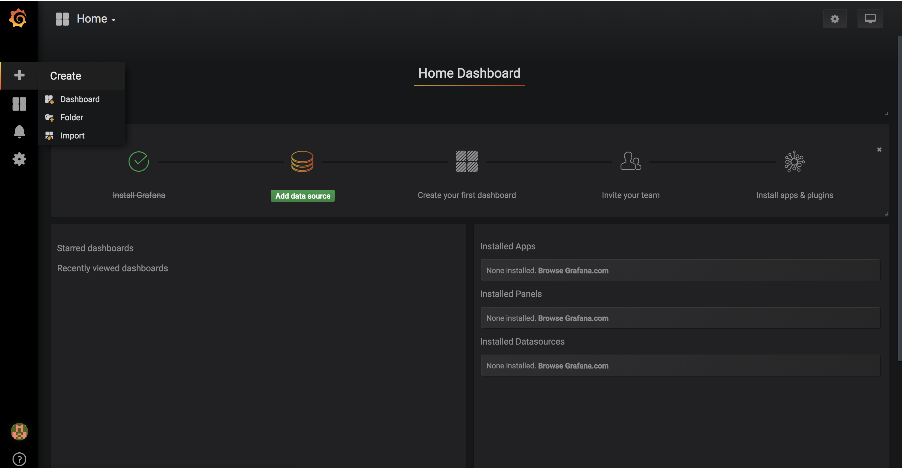
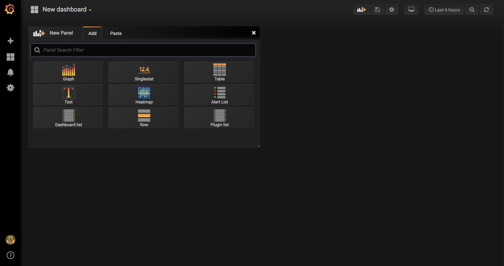
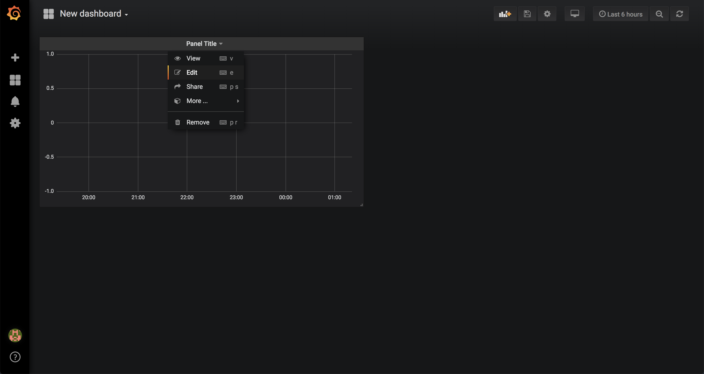
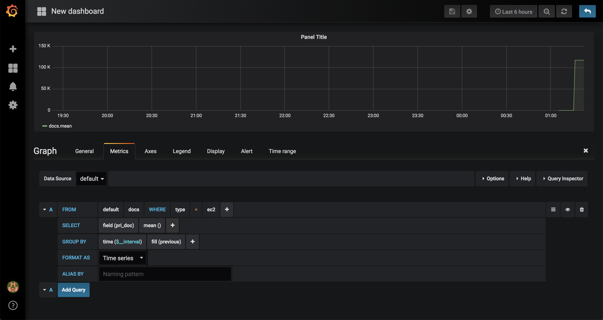
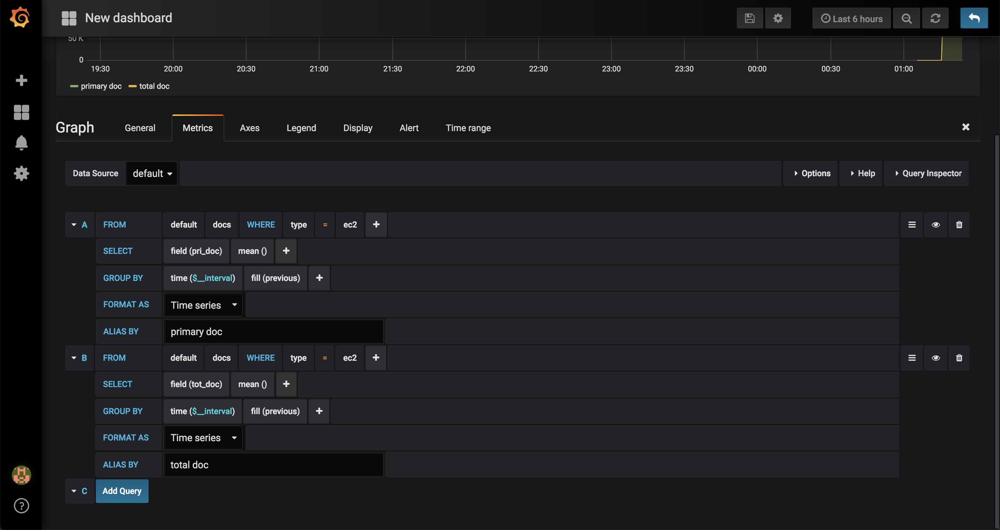
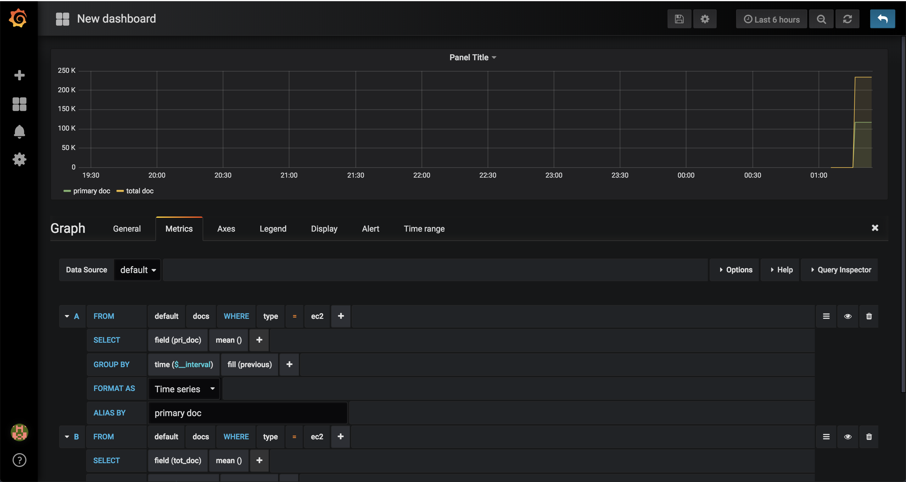
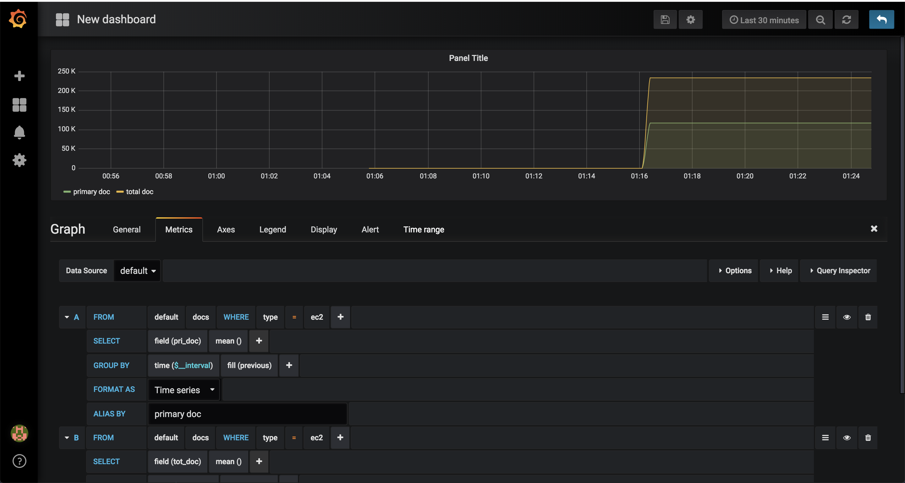
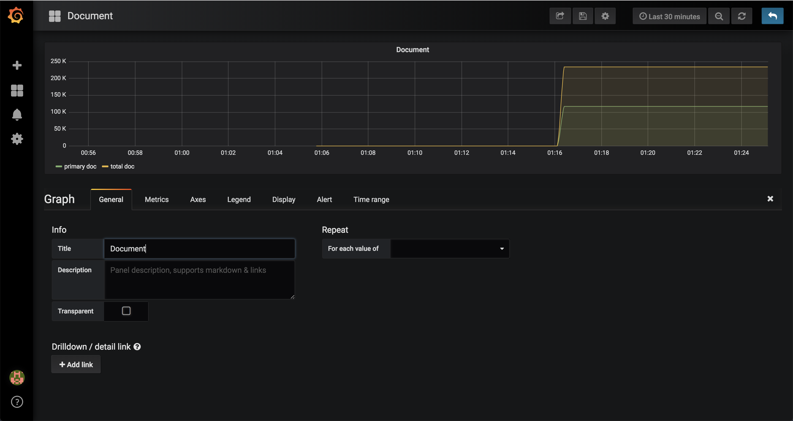
